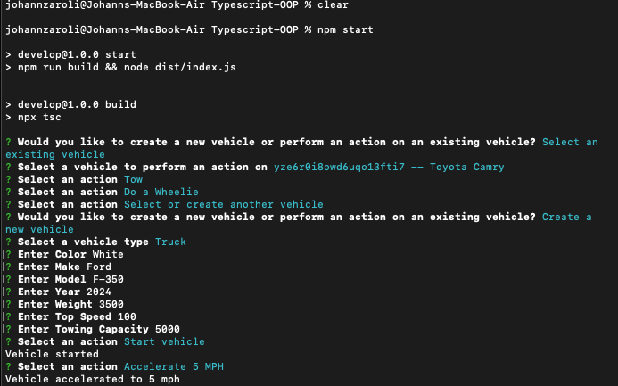
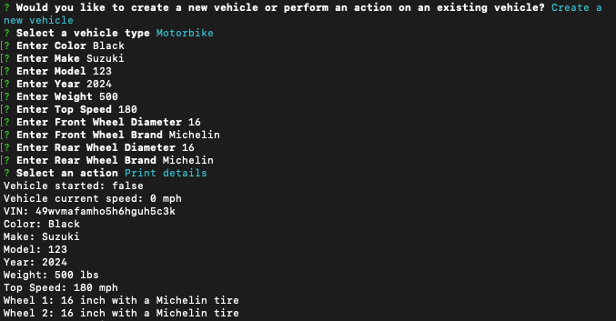

# TypeScript-OOP_Vehicle-Builder
## Description
This app runs on the command line and leverages the NPM Inquirer package to select/create new vehicle types and run operations on them.
## Usage
To run the app, run "npm install" then "npm start" from the command line. Please have a look at the demo video for a walkthrough: 
[Demo Video](https://drive.google.com/file/d/1dmeb1nkwNFHpTZ6KcFl-7RF6idYyCoEi/view?usp=drive_link)

Here are a couple screenshots, the first of the command line script and the second of the output README.md File.  
Screenshot 1:  
  
Screenshot 2:  

## Technical Features
This app was built using TypeScript, Node.js and the NPM Inquirer package.
## Credits & How to Contribute
This was created by Johann Zaroli. Please contact me on GitHub at Jzaroli with any questions or requests.
## License
MIT License

Copyright (c) <2024>

Permission is hereby granted, free of charge, to any person obtaining a copy of this software and associated documentation files (the "Software"), to deal in the Software without restriction, including without limitation the rights to use, copy, modify, merge, publish, distribute, sublicense, and/or sell copies of the Software, and to permit persons to whom the Software is furnished to do so, subject to the following conditions:

The above copyright notice and this permission notice shall be included in all copies or substantial portions of the Software.

THE SOFTWARE IS PROVIDED "AS IS", WITHOUT WARRANTY OF ANY KIND, EXPRESS OR IMPLIED, INCLUDING BUT NOT LIMITED TO THE WARRANTIES OF MERCHANTABILITY, FITNESS FOR A PARTICULAR PURPOSE AND NONINFRINGEMENT. IN NO EVENT SHALL THE AUTHORS OR COPYRIGHT HOLDERS BE LIABLE FOR ANY CLAIM, DAMAGES OR OTHER LIABILITY, WHETHER IN AN ACTION OF CONTRACT, TORT OR OTHERWISE, ARISING FROM, OUT OF OR IN CONNECTION WITH THE SOFTWARE OR THE USE OR OTHER DEALINGS IN THE SOFTWARE.
